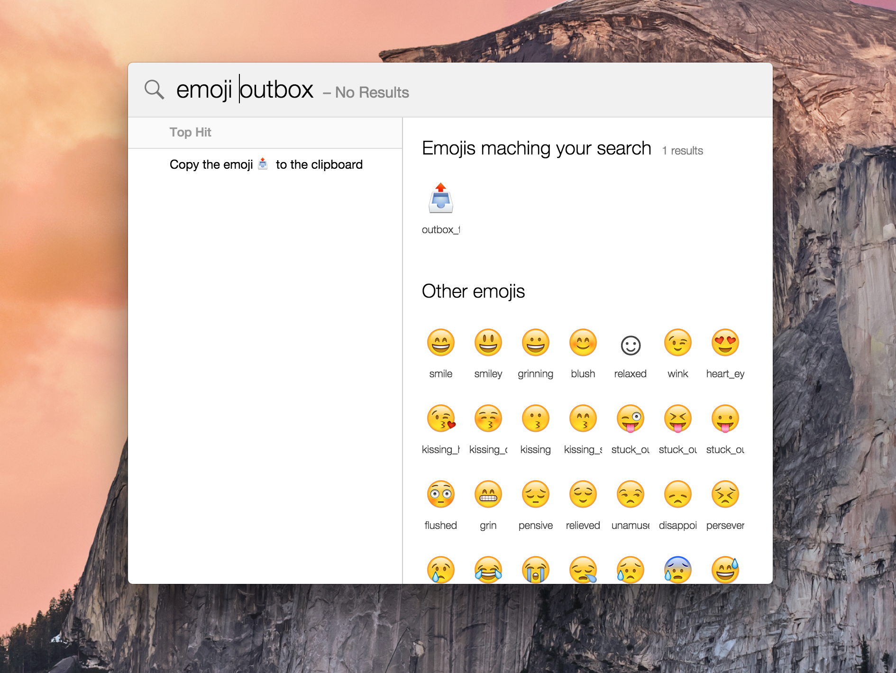
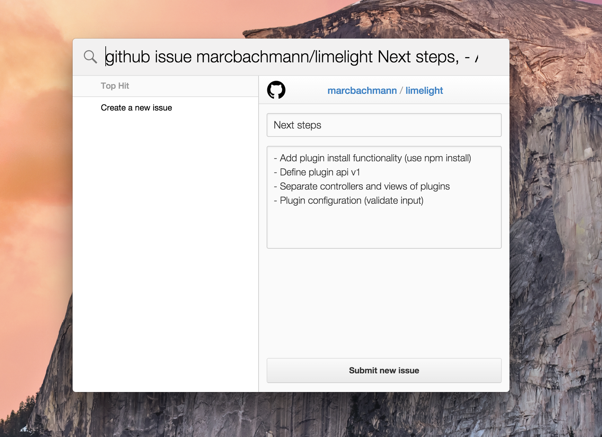
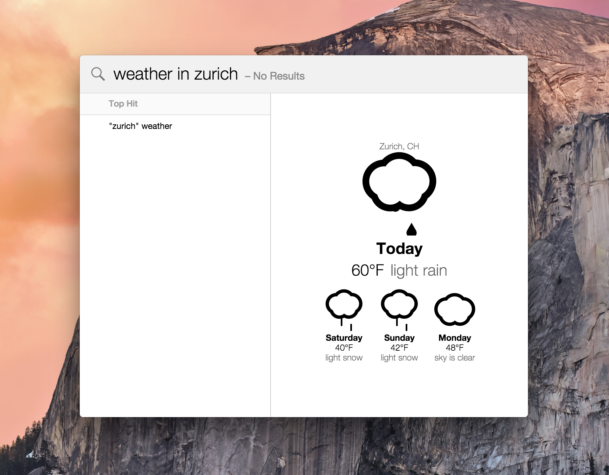

# Limelight

An extendable spotlight alternative.
Limelight is based on [electron](https://github.com/atom/electron), so it might work cross-platform. Most likely it needs some work.

This project is in a very early stage, only a few things work.

